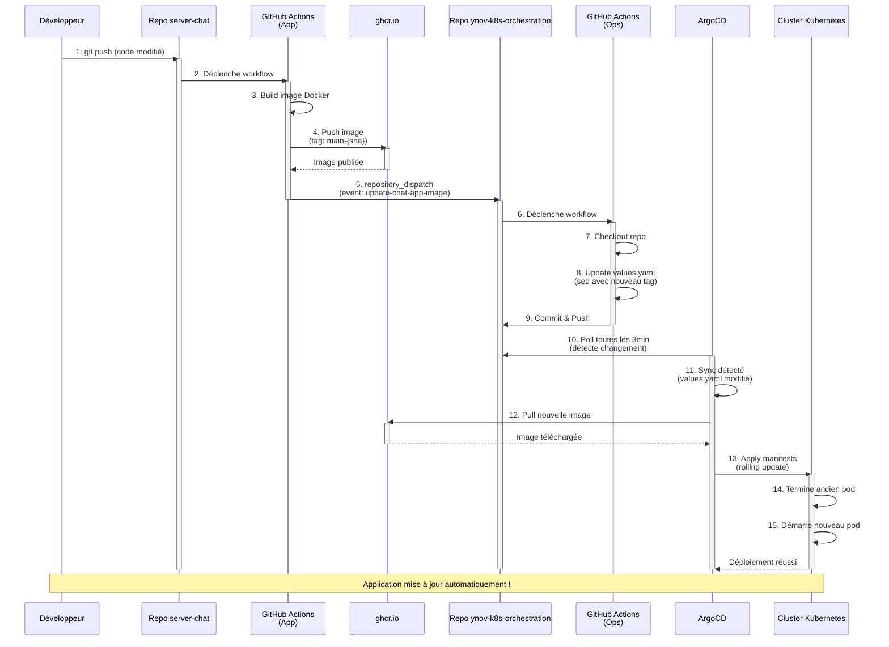

# Kubernetes Chat Application - GitOps with ArgoCD

Infrastructure as Code pour le déploiement d'une application de chat sur un cluster Kubernetes Hetzner avec ArgoCD.

## Architecture

- **Cloud Provider**: Hetzner Cloud (2 VPS)
- **Container Orchestration**: Kubernetes
- **CNI**: Calico
- **Ingress Controller**: Traefik
- **GitOps**: ArgoCD
- **Storage**: Hetzner CSI Driver
- **SSL/TLS**: Cert-Manager avec Let's Encrypt

## Stack Technique

### Infrastructure
- Hetzner Cloud Controller Manager (CCM)
- Hetzner CSI Driver pour les volumes persistants
- StorageClass avec provisionnement dynamique

### Application
- **Backend**: Chat Server (Node.js/Express)
- **Cache/DB**: Redis avec stockage persistant
- **Domaine**: sylvain-chat.duckdns.org

### CI/CD
- GitHub Actions pour le build et le push d'images
- ArgoCD pour le déploiement automatique
- Registry: GitHub Container Registry (ghcr.io)

## Structure du Projet

```
.
├── apps/
│   ├── infrastructure/          # StorageClass et ressources d'infrastructure
│   ├── cert-manager/           # Configuration SSL/TLS
│   └── chat-app/               # Application de chat (Helm Chart)
├── bootstrap/
│   └── root-app.yaml           # ArgoCD App-of-Apps
└── .github/workflows/          # CI/CD pipelines
```

## Prérequis

- **Cluster Kubernetes** avec kubectl configuré
- **LoadBalancer** fonctionnel (Hetzner CCM pour Hetzner Cloud, MetalLB, ou autre)
- **Ingress Controller** (Traefik configuré avec annotation région pour Hetzner)
- **ArgoCD** installé sur le cluster
- **Cert-Manager** pour la génération automatique de certificats SSL
- **CSI Driver** pour les volumes persistants (Hetzner CSI ou autre)
- **Domaine** pointant vers l'IP du LoadBalancer

## Installation

Voir le [WALKTHROUGH.md](WALKTHROUGH.md) pour les instructions détaillées d'installation du cluster et de tous les composants.

### Déploiement GitOps

Une fois ArgoCD installé, déployer l'application via GitOps:

```bash
kubectl apply -f https://raw.githubusercontent.com/Sipixer/ynov-k8s-orchestration/refs/heads/main/bootstrap/root-app.yaml
```

ArgoCD va automatiquement déployer:
- Infrastructure (StorageClass)
- Cert-Manager avec Let's Encrypt
- Chat-App (Redis + Chat Server)

## Workflow CI/CD



### Étapes du Pipeline

1. **Push sur le repo** [server-chat](https://github.com/Sipixer/server-chat)
2. **GitHub Actions build** et push l'image Docker vers ghcr.io
3. **GitHub Actions met à jour** `apps/chat-app/values.yaml` avec le nouveau tag
4. **ArgoCD détecte** le changement lors du prochain sync (3min)
5. **Déploiement automatique** sur le cluster Kubernetes

## Configuration Spécifique Hetzner

Pour Hetzner Cloud, les points suivants sont importants:

- **Cloud Controller Manager (CCM)**: Nécessaire pour provisionner les LoadBalancers
- **CSI Driver**: Permet le provisionnement dynamique des volumes persistants
- **Region du LoadBalancer**: Doit être spécifiée (ex: `hel1` pour Helsinki) via l'annotation `load-balancer.hetzner.cloud/location`
- **Secret API Token**: Le CCM nécessite un secret `hcloud` dans le namespace `kube-system`

Pour d'autres providers (AWS, GCP, Azure, on-premise), adapter selon les besoins avec MetalLB, Longhorn, etc.

## Notes

- **Redis**: Peut redémarrer plusieurs fois au démarrage en attendant le provisionnement du volume persistant
- **Certificats SSL**: Générés automatiquement par cert-manager via Let's Encrypt
- **Sync ArgoCD**: Poll toutes les 3 minutes pour détecter les changements

## Liens

- Application: [sylvain-chat.duckdns.org](https://sylvain-chat.duckdns.org)
- Repo App: [server-chat](https://github.com/Sipixer/server-chat)
- Repo GitOps: [ynov-k8s-orchestration](https://github.com/Sipixer/ynov-k8s-orchestration)

