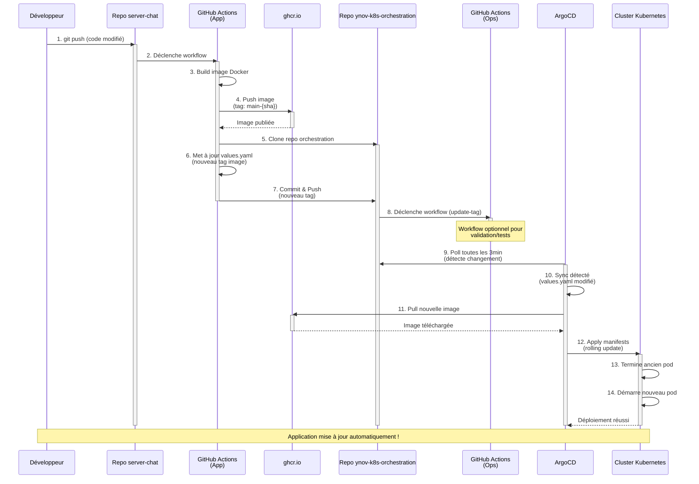

# Kubernetes Chat Application - GitOps with ArgoCD

Infrastructure as Code pour le déploiement d'une application de chat sur un cluster Kubernetes Hetzner avec ArgoCD.

## Architecture

- **Cloud Provider**: Hetzner Cloud (2 VPS)
- **Container Orchestration**: Kubernetes
- **CNI**: Calico
- **Ingress Controller**: Traefik
- **GitOps**: ArgoCD
- **Storage**: Hetzner CSI Driver
- **SSL/TLS**: Cert-Manager avec Let's Encrypt

## Stack Technique

### Infrastructure
- Hetzner Cloud Controller Manager (CCM)
- Hetzner CSI Driver pour les volumes persistants
- StorageClass avec provisionnement dynamique

### Application
- **Backend**: Chat Server (Node.js/Express)
- **Cache/DB**: Redis avec stockage persistant
- **Domaine**: sylvain-chat.duckdns.org

### CI/CD
- GitHub Actions pour le build et le push d'images
- ArgoCD pour le déploiement automatique
- Registry: GitHub Container Registry (ghcr.io)

## Structure du Projet

```
.
├── apps/
│   ├── infrastructure/          # StorageClass et ressources d'infrastructure
│   ├── cert-manager/           # Configuration SSL/TLS
│   └── chat-app/               # Application de chat (Helm Chart)
├── bootstrap/
│   └── root-app.yaml           # ArgoCD App-of-Apps
└── .github/workflows/          # CI/CD pipelines
```

## Prérequis

- Kubectl configuré avec accès au cluster
- Helm 3.x
- Compte Hetzner Cloud avec une API token
- Domaine configuré (DuckDNS)

## Installation Rapide

### 1. Configuration du Cluster Hetzner

Créer un secret avec le token API Hetzner:
```bash
kubectl create secret generic hcloud \
  --from-literal=token=<HETZNER_API_TOKEN> \
  -n kube-system
```

### 2. Installation du Cloud Controller Manager

```bash
kubectl apply -f https://raw.githubusercontent.com/hetznercloud/hcloud-cloud-controller-manager/master/deploy/ccm.yaml
```

### 3. Installation du CSI Driver

```bash
kubectl apply -f https://raw.githubusercontent.com/hetznercloud/csi-driver/refs/heads/main/deploy/kubernetes/hcloud-csi.yml
```

### 4. Installation de Traefik

```bash
helm repo add traefik https://traefik.github.io/charts
helm upgrade --install traefik traefik/traefik \
  --namespace traefik --create-namespace \
  --set service.type=LoadBalancer \
  --set service.annotations."load-balancer\.hetzner\.cloud/location"=hel1
```

### 5. Installation d'ArgoCD

```bash
kubectl create namespace argocd
kubectl apply -n argocd -f https://raw.githubusercontent.com/argoproj/argo-cd/stable/manifests/install.yaml
```

### 6. Déploiement de l'Application

```bash
kubectl apply -f https://raw.githubusercontent.com/Sipixer/ynov-k8s-orchestration/refs/heads/main/bootstrap/root-app.yaml
```

## Accès à ArgoCD

Récupérer le mot de passe admin:
```bash
kubectl -n argocd get secret argocd-initial-admin-secret -o jsonpath="{.data.password}" | base64 -d
```

Port-forward pour accéder à l'interface:
```bash
kubectl port-forward svc/argocd-server -n argocd 8080:443
```

## Workflow CI/CD



### Étapes du Pipeline

1. **Push sur le repo** [server-chat](https://github.com/Sipixer/server-chat)
2. **GitHub Actions build** et push l'image Docker vers ghcr.io
3. **GitHub Actions met à jour** `apps/chat-app/values.yaml` avec le nouveau tag
4. **ArgoCD détecte** le changement lors du prochain sync (3min)
5. **Déploiement automatique** sur le cluster Kubernetes

## Notes Importantes

- **Region du LoadBalancer**: Configurée sur `hel1` (Helsinki) pour éviter les erreurs de provisionnement, c'est obligatoire avec Hetzner.
- **Redis**: Peut redémarrer initialement en attendant le provisionnement du volume
- **StorageClass**: Utilise des volumes HDD par défaut (modifiable en SSD)

## Liens Utiles

- Repository Application: [server-chat](https://github.com/Sipixer/server-chat)
- Repository Infrastructure: [ynov-k8s-orchestration](https://github.com/Sipixer/ynov-k8s-orchestration)
- Application: [sylvain-chat.duckdns.org](https://sylvain-chat.duckdns.org)

## Troubleshooting

### LoadBalancer reste en Pending
Vérifier que le Cloud Controller Manager est déployé et que le secret `hcloud` existe dans le namespace `kube-system` et qeue la région est bien définie sur `hel1`.

### Certificat SSL non généré
Vérifier que cert-manager est déployé et que le ClusterIssuer Let's Encrypt est configuré correctement.

